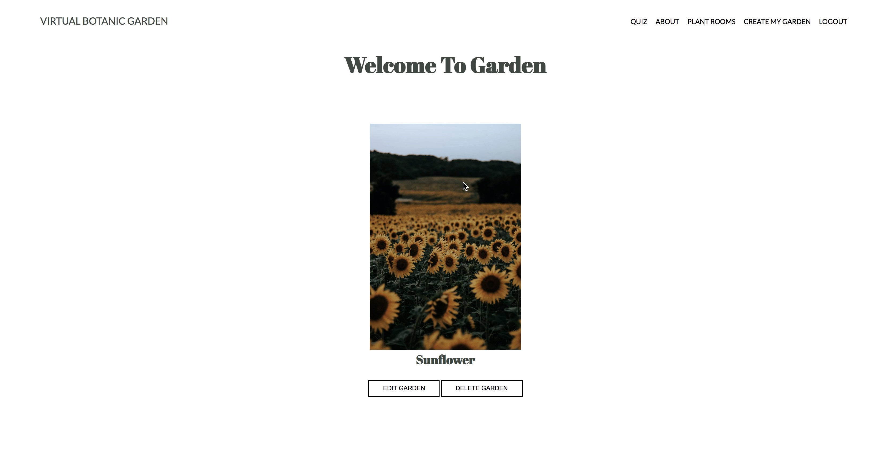

# README

## Virtual Botanic Garden 
- The Virtual Botanic Garden offers a virtual botanical garden tour. Visit different plant rooms to browse and learn about some of the most beautiful plants. Find the perfect plants for you based on your preferences and gardening level. Cacti, flowers, palms, herbs, and more are available for collection with just a few clicks. Once you have chosen which plants you would like in your garden, quickly fill out our form to create your garden. Visit this garden at any time.

## Application Features
- User can log in with a username and password
- User can navigate to garden rooms and click through each room 
- New user can create a garden 
- User can view, edit, and delete their garden
- *Future update* User can take a quiz to determine which plants are best for their lifestyle 

## Built With
- Ruby
- Rails framework with MVC architecture
- SQLite3 as the database for Active Record
- CSS for styling

## Install Instructions
- Clone this repo to your local machine git clone
- run `bundle install` to install required dependencies
- run `rails db:create` to create a database locally.
- run `rails db:migrate` to create tables into the database.
- run `rails db:seed` to create seed data.
- run `rails s` to run the server.

## Authors
- Nicole Uyigue-Sivek
- Alexa Botello